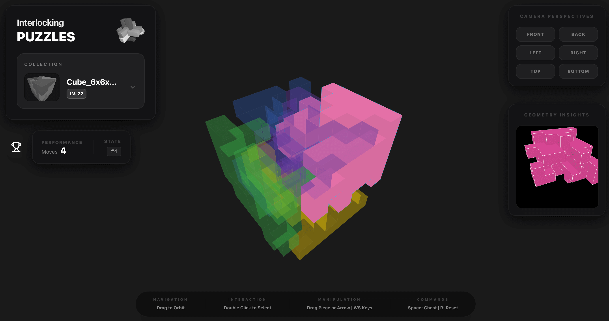

# Interlocking Puzzle

🕹️ It's a 3D [interlocking puzzle](https://www.robspuzzlepage.com/interlocking.htm) game. You can play it at [itch](https://rusyrain.itch.io/interlocking-puzzle) or https://aeriszhu.com/interlocking-puzzle/

All puzzles are generated based on [Computational Design of High-level Interlocking Puzzles](https://sutd-cgl.github.io/supp/Publication/projects/2022-SIGGRAPH-High-LevelPuzzle/index.html)

https://github.com/user-attachments/assets/7abe5533-eece-4efe-b1aa-4cedaf963c33

---

# 孔明锁

🕹️ 这是一个3D [孔明锁](https://www.robspuzzlepage.com/interlocking.htm) （鲁班锁）游戏。你可以在 [itch](https://rusyrain.itch.io/interlocking-puzzle) 或 https://aeriszhu.com/interlocking-puzzle/ 上玩。

所有谜题都是基于 [Computational Design of High-level Interlocking Puzzles](https://sutd-cgl.github.io/supp/Publication/projects/2022-SIGGRAPH-High-LevelPuzzle/index.html) 生成的。

